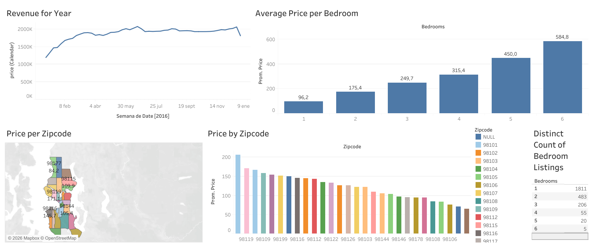
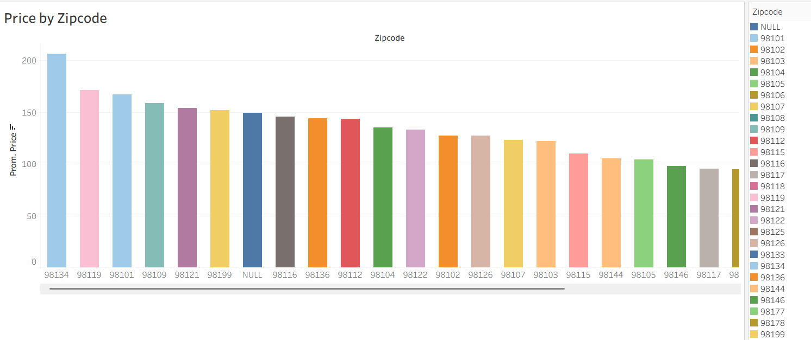
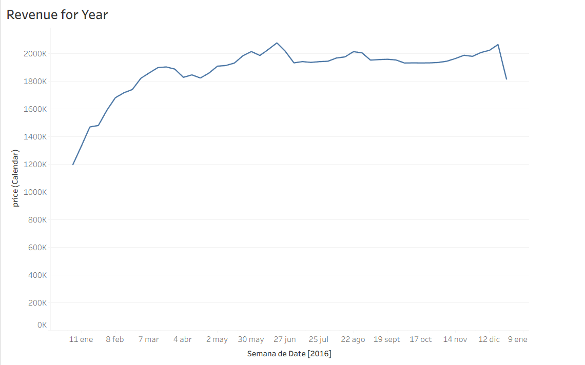

# Seattle Airbnb Market Analysis (Tableau)

## Executive Summary

This project analyzes the Seattle Airbnb market to understand pricing behavior, geographic variation, and property-level factors influencing listing prices.

The goal is to extract actionable insights that help explain how location and property characteristics impact Airbnb pricing and market demand.

## Problem Statement

Airbnb pricing varies significantly based on location, property type, and size. However, it is not always clear which factors have the strongest influence on price.

This project aims to answer:

- What drives Airbnb pricing in Seattle?
- How does location affect listing value?
- What property characteristics influence price the most?

## Dataset

Seattle Airbnb Open Data (2016) from Kaggle  
https://www.kaggle.com/datasets/airbnb/seattle

## Tools Used

- Tableau
- Excel
- Exploratory Data Analysis (EDA)
- Data Visualization

## Analysis Approach

- Cleaned and prepared dataset for analysis
- Explored pricing patterns across time, geography, and property type
- Built interactive Tableau dashboard to visualize insights
- Analyzed relationships between price, location, and bedroom count

  ## Key Insights

- Listing prices increase consistently with the number of bedrooms
- Certain ZIP codes have significantly higher average prices, showing strong location impact
- Most Airbnb listings are concentrated in 1–2 bedroom properties
- Revenue patterns remain relatively stable across the year with mild fluctuations

## Dashboard Preview

### Overview Dashboard

### Price by ZIP Code

### Revenue Trends

## Conclusion

This analysis shows that both location and property size are key drivers of Airbnb pricing in Seattle.
The findings can help hosts optimize pricing strategies and help investors identify high-value areas for short-term rental opportunities.

## View Interactive Dashboard

[Click here to view Tableau Dashboard](https://public.tableau.com/app/profile/maria.ta8132/viz/tableauproject_17725293699940/Dashboard1)
